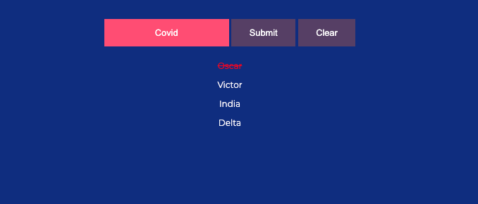

# Nato Phonetic Alphabet Converter

This simple application takes a set of words/phrase and converts it to the Nato Alphabet.
I developed this for the global Salesforce IT team. (through the Techforce Innovation Program)

## Background 
- As an IT support agent, sometimes it is required to use NATO Phonetic Alphabets while on a call. Especially when describing names, passwords, recovery keys etc.

 
## Info

Enter a phrase/word you need to convert and press enter or submit. 

"Covid" will output: Charlie, Oscar, Victor, India, Delta

Click on each converted word to remove it as you go!

## Check it out live!
[Nato Converter](https://nyancodes.github.io/Nato-Converter/) on Github Pages

#
